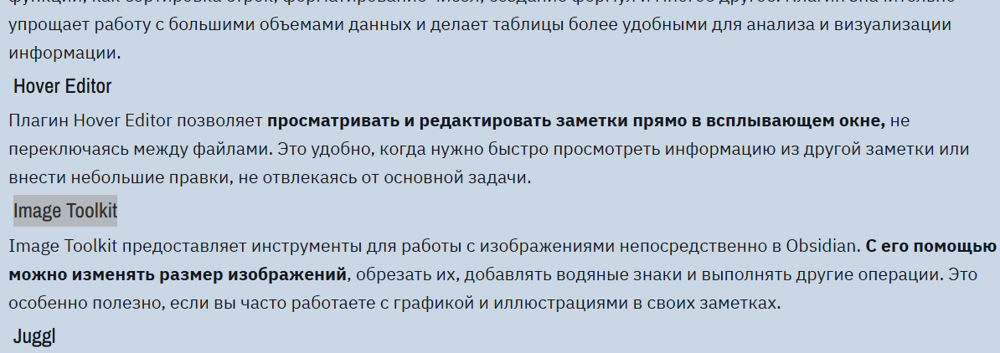

# Структура Java core

|                                                                                                                                                                                                                                                                                                                                                                                                                                                                                                                                                                                                                                                                                                                                                                                                                                                                                                                                                                                                                                                                                                                                                                                                                                                                                                                                                                                                                                                                                                                                                                                                                                                                                                                                                                                                                                                                                                                                                                                                                                                                                                                                                                                                                                                                                                                                                                                                                                                                                                                                                                                                                                                                                                                                                                                                                                                                                                                                                                                                                                                                                                                                                                                                                                                                                                                                                                                                                                                                                                                                                                                                                                                                                                                                                                                                                                                                                                |                                                                                                                                                                                                                                                                                                                                                                                                                                                                                                                                                                                                                                                                                                                                                                                                                                                                                                                                                                                                                                                                                                                                                                                                                                                                                                                                                                                                                                                                                                                                                                                                                                                                                                                                                                                                                                                                                                                                                                                                                                                                                                                                                                                                                                                                                                                                                                                                                                                                                                                                                                                                                                                                                                                                                                                                                                                                                                                                                                                                                                                                                                                                                                                                                                                                                                                                                                                                                                                                                                                                                                                                                                                                                                                                                                                                                                                                                                                                                                                                                                                                                                                                                                                                                                                                                                                                                                                                                                                                                                                                                                                                                                                                                                                                                                                                                                                                                                                                                                                                                                                                                                                                                                                                                                                                                                                                                                                                                                                                                                                                                                                                                                                                                                                                                                                                                                                                                                                                                                                                                                                                                                                                                                                                                                                                                                                                                                                                                                                                                                                                                                                                                                                                                                                                                                                                                                                                                                                                                                                                                                                                                                                                                                                                                                                                                                                                                                                                                                                                                                                                                                                                                                                                                                                                                                                                                                                                                                                                                                                                                                                                                                                                                                                                                                                                                                                                                                                                                                                 |
| ---------------------------------------------------------------------------------------------------------------------------------------------------------------------------------------------------------------------------------------------------------------------------------------------------------------------------------------------------------------------------------------------------------------------------------------------------------------------------------------------------------------------------------------------------------------------------------------------------------------------------------------------------------------------------------------------------------------------------------------------------------------------------------------------------------------------------------------------------------------------------------------------------------------------------------------------------------------------------------------------------------------------------------------------------------------------------------------------------------------------------------------------------------------------------------------------------------------------------------------------------------------------------------------------------------------------------------------------------------------------------------------------------------------------------------------------------------------------------------------------------------------------------------------------------------------------------------------------------------------------------------------------------------------------------------------------------------------------------------------------------------------------------------------------------------------------------------------------------------------------------------------------------------------------------------------------------------------------------------------------------------------------------------------------------------------------------------------------------------------------------------------------------------------------------------------------------------------------------------------------------------------------------------------------------------------------------------------------------------------------------------------------------------------------------------------------------------------------------------------------------------------------------------------------------------------------------------------------------------------------------------------------------------------------------------------------------------------------------------------------------------------------------------------------------------------------------------------------------------------------------------------------------------------------------------------------------------------------------------------------------------------------------------------------------------------------------------------------------------------------------------------------------------------------------------------------------------------------------------------------------------------------------------------------------------------------------------------------------------------------------------------------------------------------------------------------------------------------------------------------------------------------------------------------------------------------------------------------------------------------------------------------------------------------------------------------------------------------------------------------------------------------------------------------------------------------------------------------------------------------------------------------- | ----------------------------------------------------------------------------------------------------------------------------------------------------------------------------------------------------------------------------------------------------------------------------------------------------------------------------------------------------------------------------------------------------------------------------------------------------------------------------------------------------------------------------------------------------------------------------------------------------------------------------------------------------------------------------------------------------------------------------------------------------------------------------------------------------------------------------------------------------------------------------------------------------------------------------------------------------------------------------------------------------------------------------------------------------------------------------------------------------------------------------------------------------------------------------------------------------------------------------------------------------------------------------------------------------------------------------------------------------------------------------------------------------------------------------------------------------------------------------------------------------------------------------------------------------------------------------------------------------------------------------------------------------------------------------------------------------------------------------------------------------------------------------------------------------------------------------------------------------------------------------------------------------------------------------------------------------------------------------------------------------------------------------------------------------------------------------------------------------------------------------------------------------------------------------------------------------------------------------------------------------------------------------------------------------------------------------------------------------------------------------------------------------------------------------------------------------------------------------------------------------------------------------------------------------------------------------------------------------------------------------------------------------------------------------------------------------------------------------------------------------------------------------------------------------------------------------------------------------------------------------------------------------------------------------------------------------------------------------------------------------------------------------------------------------------------------------------------------------------------------------------------------------------------------------------------------------------------------------------------------------------------------------------------------------------------------------------------------------------------------------------------------------------------------------------------------------------------------------------------------------------------------------------------------------------------------------------------------------------------------------------------------------------------------------------------------------------------------------------------------------------------------------------------------------------------------------------------------------------------------------------------------------------------------------------------------------------------------------------------------------------------------------------------------------------------------------------------------------------------------------------------------------------------------------------------------------------------------------------------------------------------------------------------------------------------------------------------------------------------------------------------------------------------------------------------------------------------------------------------------------------------------------------------------------------------------------------------------------------------------------------------------------------------------------------------------------------------------------------------------------------------------------------------------------------------------------------------------------------------------------------------------------------------------------------------------------------------------------------------------------------------------------------------------------------------------------------------------------------------------------------------------------------------------------------------------------------------------------------------------------------------------------------------------------------------------------------------------------------------------------------------------------------------------------------------------------------------------------------------------------------------------------------------------------------------------------------------------------------------------------------------------------------------------------------------------------------------------------------------------------------------------------------------------------------------------------------------------------------------------------------------------------------------------------------------------------------------------------------------------------------------------------------------------------------------------------------------------------------------------------------------------------------------------------------------------------------------------------------------------------------------------------------------------------------------------------------------------------------------------------------------------------------------------------------------------------------------------------------------------------------------------------------------------------------------------------------------------------------------------------------------------------------------------------------------------------------------------------------------------------------------------------------------------------------------------------------------------------------------------------------------------------------------------------------------------------------------------------------------------------------------------------------------------------------------------------------------------------------------------------------------------------------------------------------------------------------------------------------------------------------------------------------------------------------------------------------------------------------------------------------------------------------------------------------------------------------------------------------------------------------------------------------------------------------------------------------------------------------------------------------------------------------------------------------------------------------------------------------------------------------------------------------------------------------------------------------------------------------------------------------------------------------------------------------------------------------------------------------------------------------------------------------------------------------------------------------------------------------------------------------------------------------------------------------------------------------------------------------------------------------------------------------------------------------------------------------------------------------------------------------------------------------------------------------------------- |
| <ul><li><strong><a href="JAVA-CORE/Основы-java-(Вводная)" style="color: #4b5320;" style="color: #4b5320;">Основы java (Вводная)</strong></a><ul><li><strong>1.</strong> <a href="JAVA-CORE/1. Ключевые концепции и синтаксис" target="_blank" style="color: #808080;">Ключевые концепции и синтаксис</a></li><li><strong>2.</strong> <a href="JAVA-CORE/2. Модификаторы" style="color: #808080;">Модификаторы</a></li><li><strong>3.</strong> <a href="JAVA-CORE/3. Типы данных и переменные" style="color: #808080;">Типы данных и переменные</a><ul><li style="list-style-type: none;"><ul><li><a href="JAVA-CORE/Примитивный тип данных" style="color: #800000;">Примитивный тип данных</a></li><li><a href="JAVA-CORE/Ссылочный тип данных" style="color: #808080;">Ссылочный тип данных</a></li><li><a href="JAVA-CORE/Преобразования типов" style="color: #5c1f01;">Преобразования типов</a></li></ul></li></ul></li><li><strong>4.</strong> <a href="JAVA-CORE/4. Циклы, операторы, выражения" style="color: #808080;">Циклы, операторы, выражения</a><ul><li style="list-style-type: none;"><ul><li><a href="JAVA-CORE/while && do while (циклы)" style="color: #800000;">while / do while (циклы)</a></li><li><a href="JAVA-CORE/for && for-each (циклы)" style="color: #800000;">for / for-each (циклы)</a></li><li><a href="JAVA-CORE/Switch - case" style="color: #800000;">Switch - case</a></li><li><a href="JAVA-CORE/If - Else" style="color: #800000;">If - Else</a></li><li><a href="JAVA-CORE/Ternary Operator" style="color: #800000;">Ternary Operator</a></li><li><a href="JAVA-CORE/Логические операторы" style="color: #800000;">Логические операторы</a></li></ul></li></ul></li><li><strong>5.</strong> <a href="JAVA-CORE/5. Исключения" style="color: #800000;">Исключения</a></li></ul></li></ul><ul><li><strong><a href="JAVA-CORE/Ключевые ООП концепции">Ключевые ООП концепции:</strong></a><ul><li><strong>1</strong>. <a href="1. Wrapper Classes (Обертки)" style="color: #808080;">Wrapper Classes (Обертки)</a></li><li><strong>2</strong>. <a href="JAVA-CORE/2. Лямбда выражения и ссылки" style="color: #808080;">Лямбда выражения и ссылки</a></li><li><strong>3</strong>. <a href="JAVA-CORE/3. Функциональное программирование" style="color: #808080;">Функциональное программирование</a><ul><li style="list-style-type: none;"><ul><li><a href="JAVA-CORE/Функциональные интерфейсы" style="color: #800000;">Функциональные интерфейсы</a></li><li><a href="JAVA-CORE/Stream" style="color: #800000;">Stream</a></li></ul></li></ul></li><li><strong>4</strong>.  <a href="JAVA-CORE/4. Generics (Обобщенные классы)" style="color: #000000;">Generics (Обобщенные классы)</a></li><li><strong>5</strong>.  <a href="JAVA-CORE/5. Динамическая диспетчеризация" style="color: #000080;">Динамическая диспетчеризация</a></li><li><strong>6</strong>. <a href="JAVA-CORE/6. Многопоточность" style="color: #000000;"> Многопоточность</a></li></ul></li></ul> | <ul><li><strong><a href="obsidian://open?vault=Obsidian_Java&file=Obsidian_Java%2FJava%2FLearn%20Java%2FJAVA%20CORE%2F%D0%9E%D0%B1%D1%8A%D0%B5%D0%BA%D1%82%D0%BD%D0%BE-%D0%9E%D1%80%D0%B8%D0%B5%D0%BD%D1%82%D0%B8%D1%80%D0%BE%D0%B2%D0%B0%D0%BD%D0%BD%D0%BE%D0%B5%20%D0%9F%D1%80%D0%BE%D0%B3%D1%80%D0%B0%D0%BC%D0%BC%D0%B8%D1%80%D0%BE%D0%B2%D0%B0%D0%BD%D0%B8%D0%B5" target="_blank" style="color: #4b5320;">Объектно-Ориентированное Программирование:</a></strong><ul><li><strong>1.</strong> <a href="obsidian://open?vault=Obsidian_Java&file=Obsidian_Java%2FJava%2FLearn%20Java%2FJAVA%20CORE%2F1.%20%D0%9A%D0%BB%D0%B0%D1%81%D1%81%D1%8B%20%D0%B8%20%D0%BE%D0%B1%D1%8A%D0%B5%D0%BA%D1%82%D1%8B" target="_blank" style="color: #808080;">Классы и объекты</a><ul><li style="list-style-type: none;"><ul><li><a href="obsidian://open?vault=Obsidian_Java&file=Obsidian_Java%2FJava%2FLearn%20Java%2FJAVA%20CORE%2F%D0%A1%D0%B8%D0%BD%D1%82%D0%B0%D0%BA%D1%81%D0%B8%D1%81%20%D0%BA%D0%BB%D0%B0%D1%81%D1%81%D0%BE%D0%B2" target="_blank" style="color: #800000;">Синтаксис классов</a></li><li><a href="obsidian://open?vault=Obsidian_Java&file=Obsidian_Java%2FJava%2FLearn%20Java%2FJAVA%20CORE%2F%D0%92%D0%BB%D0%BE%D0%B6%D0%B5%D0%BD%D0%BD%D1%8B%D0%B5%20%D0%BA%D0%BB%D0%B0%D1%81%D1%81%D1%8B%20(Nested%2C%20Local%2C%20Anonymous)" target="_blank" style="color: #800000;">Вложенные классы (Nested, Local, Anonymous)</a></li><li><a href="obsidian://open?vault=Obsidian_Java&file=Obsidian_Java%2FJava%2FLearn%20Java%2FJAVA%20CORE%2F%D0%90%D0%B1%D1%81%D1%82%D1%80%D0%B0%D0%BA%D1%82%D0%BD%D1%8B%D0%B5%20%D0%BA%D0%BB%D0%B0%D1%81%D1%81%D1%8B" target="_blank" style="color: #800000;">Абстрактные классы</a></li></ul></li></ul></li><li><strong>2.</strong> <a href="obsidian://open?vault=Obsidian_Java&file=Obsidian_Java%2FJava%2FLearn%20Java%2FJAVA%20CORE%2F2.%20%D0%9C%D0%B5%D1%82%D0%BE%D0%B4%D1%8B" target="_blank" style="color: #808080;">Методы</a><ul><li style="list-style-type: none;"><ul><li><a href="obsidian://open?vault=Obsidian_Java&file=Obsidian_Java%2FJava%2FLearn%20Java%2FJAVA%20CORE%2F%D0%9F%D0%B5%D1%80%D0%B5%D0%B3%D1%80%D1%83%D0%B7%D0%BA%D0%B0%20%D0%BC%D0%B5%D1%82%D0%BE%D0%B4%D0%BE%D0%B2" target="_blank" style="color: #800000;">Перегрузка методов</a></li><li><a href="obsidian://open?vault=Obsidian_Java&file=Obsidian_Java%2FJava%2FLearn%20Java%2FJAVA%20CORE%2F%D0%9F%D0%B5%D1%80%D0%B5%D0%BE%D0%BF%D1%80%D0%B5%D0%B4%D0%B5%D0%BB%D0%B5%D0%BD%D0%B8%D0%B5%20%D0%BC%D0%B5%D1%82%D0%BE%D0%B4%D0%BE%D0%B2" target="_blank" style="color: #800000;">Переопределение методов</a></li></ul></li></ul></li><li><strong>3. </strong> <a href="obsidian://open?vault=Obsidian_Java&file=Obsidian_Java%2FJava%2FLearn%20Java%2FJAVA%20CORE%2F3.%20%D0%98%D0%BD%D1%82%D0%B5%D1%80%D1%84%D0%B5%D0%B9%D1%81%D1%8B" target="_blank" style="color: #800000;">Интерфейсы</a></li><li><strong>4. </strong> <a href="obsidian://open?vault=Obsidian_Java&file=Obsidian_Java%2FJava%2FLearn%20Java%2FJAVA%20CORE%2F4.%20Static%20%D0%B8%20final%20%D1%8D%D0%BB%D0%B5%D0%BC%D0%B5%D0%BD%D1%82%D1%8B" target="_blank" style="color: #800000;">Static и final элементы</a></li><li><strong>5. </strong><a href="obsidian://open?vault=Obsidian_Java&file=Obsidian_Java%2FJava%2FLearn%20Java%2FJAVA%20CORE%2F5.%20%D0%9E%D0%B1%D0%BB%D0%B0%D1%81%D1%82%D0%B8%20%D0%B2%D0%B8%D0%B4%D0%B8%D0%BC%D0%BE%D1%81%D1%82%D0%B8" target="_blank" style="color: #808080;"> Области видимости</a></li><li><strong>6. </strong><a href="obsidian://open?vault=Obsidian_Java&file=Obsidian_Java%2FJava%2FLearn%20Java%2FJAVA%20CORE%2F6.%20%D0%9E%D1%81%D0%BD%D0%BE%D0%B2%D0%BD%D1%8B%D0%B5%20%D0%BF%D1%80%D0%B8%D0%BD%D1%86%D0%B8%D0%BF%D1%8B%20%D0%9E%D0%9E%D0%9F" target="_blank" style="color: #800000;">Основные принципы ООП</a> <ul><li style="list-style-type: none;"><ul><li><a href="obsidian://open?vault=Obsidian_Java&file=Obsidian_Java%2FJava%2FLearn%20Java%2FJAVA%20CORE%2F%D0%98%D0%BD%D0%BA%D0%B0%D0%BF%D1%81%D1%83%D0%BB%D1%8F%D1%86%D0%B8%D1%8F%20(Encapsulation)" target="_blank" style="color: #800000;">Инкапсуляция (Encapsulation)</a></li><li><a href="obsidian://open?vault=Obsidian_Java&file=Obsidian_Java%2FJava%2FLearn%20Java%2FJAVA%20CORE%2F%D0%9D%D0%B0%D1%81%D0%BB%D0%B5%D0%B4%D0%BE%D0%B2%D0%B0%D0%BD%D0%B8%D0%B5%20(Inheritance)" target="_blank" style="color: #800000;">Наследование (Inheritance)</a></li><li><a href="obsidian://open?vault=Obsidian_Java&file=Obsidian_Java%2FJava%2FLearn%20Java%2FJAVA%20CORE%2F%D0%9F%D0%BE%D0%BB%D0%B8%D0%BC%D0%BE%D1%80%D1%84%D0%B8%D0%B7%D0%BC%20(Polymorphism)" target="_blank" style="color: #800000;">Полиморфизм (Polymorphism)</a></li><li><a href="obsidian://open?vault=Obsidian_Java&file=Obsidian_Java%2FJava%2FLearn%20Java%2FJAVA%20CORE%2F%D0%90%D0%B1%D1%81%D1%82%D1%80%D0%B0%D0%BA%D1%86%D0%B8%D1%8F%20(Abstraction)" target="_blank" style="color: #800000;">Абстракция (Abstraction)</a></li></ul></li></ul></li></ul></li></ul><ul><li><a href="obsidian://open?vault=Obsidian_Java&file=Obsidian_Java%2FJava%2FLearn%20Java%2FJAVA%20CORE%2F%D0%9A%D0%BE%D0%BB%D0%BB%D0%B5%D0%BA%D1%86%D0%B8%D0%B8%20%D0%B8%20%D1%81%D1%82%D1%80%D1%83%D0%BA%D1%82%D1%83%D1%80%D1%8B%20%D0%B4%D0%B0%D0%BD%D0%BD%D1%8B%D1%85" target="_blank" style="color: #800000;"><strong>Коллекции и структуры данных:</strong></a><ul><li><strong>1. </strong> <a href="obsidian://open?vault=Obsidian_Java&file=Obsidian_Java%2FJava%2FLearn%20Java%2FJAVA%20CORE%2F1.%20%D0%9C%D0%B0%D1%81%D1%81%D0%B8%D0%B2%D1%8B%20(%D0%B8%D0%BD%D1%82%D0%B5%D1%80%D1%84%D0%B5%D0%B9%D1%81%20Arrays)" target="_blank" style="color: #000000;">Массивы (интерфейс Arrays)</a><ul><li style="list-style-type: none;"><ul><li><a href="obsidian://open?vault=Obsidian_Java&file=Obsidian_Java%2FJava%2FLearn%20Java%2FJAVA%20CORE%2F%D0%9C%D0%B0%D1%81%D1%81%D0%B8%D0%B2%D1%8B%20(Array)" target="_blank" style="color: #800000;">Массивы (Array)</a></li></ul></li></ul></li><li><strong>2. </strong> <a href="obsidian://open?vault=Obsidian_Java&file=Obsidian_Java%2FJava%2FLearn%20Java%2FJAVA%20CORE%2F2.%20%D0%9A%D0%BE%D0%BB%D0%BB%D0%B5%D0%BA%D1%86%D0%B8%D0%B8%20(%D0%B8%D0%BD%D1%82%D0%B5%D1%80%D1%84%D0%B5%D0%B9%D1%81%20Collections)" target="_blank" style="color: #000000;">Коллекции (интерфейс Collections)</a><ul><li style="list-style-type: none;"><ul><li><a href="obsidian://open?vault=Obsidian_Java&file=Obsidian_Java%2FJava%2FLearn%20Java%2FJAVA%20CORE%2F%D0%A1%D0%BF%D0%B8%D1%81%D0%BA%D0%B8%20(List)" target="_blank" style="color: #800000;">Списки (List)</a></li><li><a href="obsidian://open?vault=Obsidian_Java&file=Obsidian_Java%2FJava%2FLearn%20Java%2FJAVA%20CORE%2F%D0%9C%D0%BD%D0%BE%D0%B6%D0%B5%D1%81%D1%82%D0%B2%D0%B0%20(Set)" target="_blank" style="color: #800000;">Множества (Set)</a> </li><li><a href="obsidian://open?vault=Obsidian_Java&file=Obsidian_Java%2FJava%2FLearn%20Java%2FJAVA%20CORE%2F%D0%9E%D1%87%D0%B5%D1%80%D0%B5%D0%B4%D1%8C%20(QUEUE%20%D0%B8%20DEQUE)" target="_blank" style="color: #800000;">Очередь (QUEUE и DEQUE)</a></li><li><a href="obsidian://open?vault=Obsidian_Java&file=Obsidian_Java%2FJava%2FLearn%20Java%2FJAVA%20CORE%2F%D0%9A%D0%B0%D1%80%D1%82%D1%8B%20(Map)" target="_blank" style="color: #800000;">Карты (Map)</a></li></ul></li></ul></li></ul></li></ul>   |

[[Без названия]]

![[Pasted image 20260201234113.png]]

|                                      |                                                                 |
| ------------------------------------ | --------------------------------------------------------------- |
| ![[Pasted image 20260201234113.png]] | выввввввввввввввввввввввввввввввввввввввввввввввввввввввввввввв |

[[Drawing 2026-02-01 23.44.24.excalidraw]]

https://drive.google.com/file/d/13gHE8topC-syL1SqlNhPUf5LPMM4_I70/view?usp=sharing

